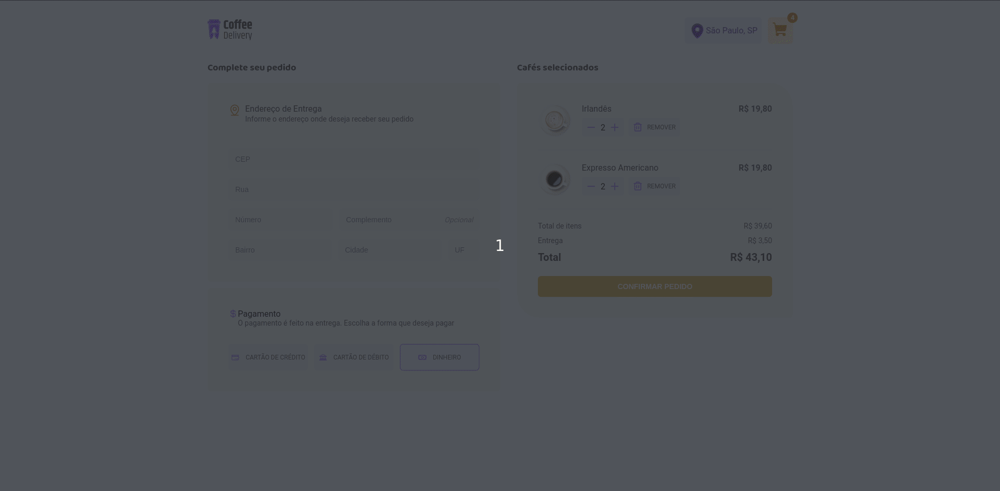

<center>

# Coffee Delivery

</center>

## 🖥 Sobre o projeto

Este é um desafio proposto no curso Ignite da Rocketseat, onde desenvolvemos uma aplicação React para uma cafeteria fictícia com foco em delivery.

A aplicação conta com diversas funcionalidades, permitindo que o usuário navegue pela lista de produtos disponíveis, adicione itens ao carrinho, preencha um formulário de endereço, visualize o valor total do pedido e finalize a compra.

## 🎥 Demonstração




## 📦 Como Executar?

> Clone o Repositório:

```bash
git clone https://github.com/timoteo0/ignite-coffee-delivery.git
```

> Instale as dependências:

```bash
npm install
```

> Inicie o Serviço:

```bash
npm run dev
```

> ➡️ Acesse [http://localhost:3000](http://localhost:3000) para acessar a aplicação web.

## 🔨 Tecnologias

- [React](https://reactjs.org/)
- [Typescript](https://www.typescriptlang.org/)
- [Vite](https://vitejs.dev/)
- [phosphor-react](https://phosphoricons.com/)
- [react-hook-form](https://react-hook-form.com/)
- [styled-components](https://styled-components.com/)
- [react-router-dom](https://reactrouter.com/en/main)

## Autor

<a href="https://github.com/timoteo0">
 
 <br />
 <sub><b>Timoteo Nascimento</b></sub></a> <a href="https://github.com/timoteo0" title="Rocketseat">🚀</a>

Feito com ❤️ por Timoteo Nascimento.
